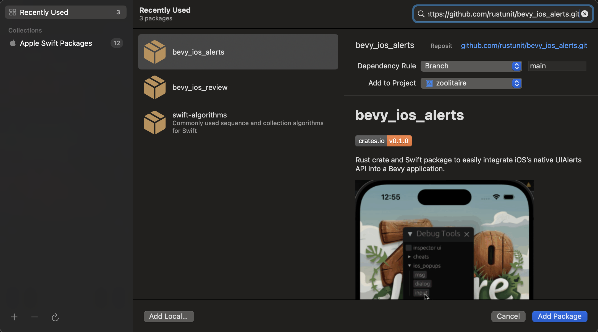

# bevy_ios_notifications

[](https://bevyengine.org/learn/quick-start/plugin-development/#main-branch-tracking)
[](https://crates.io/crates/bevy_ios_notifications)
[](https://docs.rs/bevy_ios_notifications)
[![discord][sh_discord]][lk_discord]

[sh_discord]: https://img.shields.io/discord/1176858176897953872?label=discord&color=5561E6
[lk_discord]: https://discord.gg/rQNeEnMhus

Rust crate and Swift package to easily integrate iOS's native Notification API into a Bevy application.

https://github.com/rustunit/bevy_ios_notifications/assets/776816/78e9d708-1cdd-4e54-af2a-c6a5b787f98b

Demo from our game using this crate: [zoolitaire.com](https://zoolitaire.com)

## Features

* change/read badge
* get remote push deviceToken
* scheduling local notifications
* enable/disable presenting notifications while app is foregrounded
* and the notoriously hard (in unity) to do things like: what notification was clicked

## Instructions

1. Add to XCode: Add SPM (Swift Package Manager) dependency
2. Add Rust dependency
3. Setup Plugin

Use [Apple Push Notification Dashboard](https://icloud.developer.apple.com/dashboard/notifications) to simply send push notifications for testing.

### 1. Add to XCode

Go to `File` -> `Add Package Dependencies` and paste `https://github.com/rustunit/bevy_ios_notifications.git` into the search bar on the top right:


### 2. Add Rust dependency

```
cargo add bevy_ios_notifications
```

or

```
bevy_ios_notifications = { version = "0.6" }
```

### 3. Setup Plugin

Initialize Bevy Plugin:

```rust
// requests permissions for alerts, sounds and badges
app.add_plugins(bevy_ios_notifications::IosNotificationsPlugin::request_permissions_on_start(true, true, true));
```

Trigger Alert in your application code:

```rust
fn system_triggering_notifications(ios_notifications: NonSend<IosNotificationsResource>) {

    // should be called after the permission response arrives
    ios_notifications.registered_for_push();

    // set app icon badge
    ios_notifications.set_badge(1);

    // schedule a local notification
    let id = IosNotificationsResource::schedule(
        IosNotificationRequest::new()
            .title("title")
            .body("body")
            .trigger(IosNotificationTrigger::one_shot(4))
            // if not defined it will be creating a UUID for you
            .identifier("custom id")
            .build(),
    );

}

// this will clear the badge, the notification center and all pending ones
fn process_occluded_events(
    mut e: EventReader<WindowOccluded>,
    ios_notifications: NonSend<IosNotificationsResource>,
) {
    for ev in e.read() {
        if !ev.occluded {
            ios_notifications.remove_all_pending();
            ios_notifications.remove_all_delivered();
            ios_notifications.set_badge(0);
        }
    }
}

// process async events coming in from ios notification system
fn process_notifications(
    mut events: EventReader<IosNotificationEvents>,
) {
    for e in events.read() {
        match e {
            IosNotificationEvents::PermissionResponse(_) => todo!(),
            IosNotificationEvents::NotificationSchedulingSucceeded(_) => todo!(),
            IosNotificationEvents::NotificationSchedulingFailed(_) => todo!(),
            IosNotificationEvents::NotificationTriggered(_) => todo!(),
            IosNotificationEvents::PendingNotifications(_) => todo!(),
            IosNotificationEvents::NotificationResponse(_) => todo!(),
            IosNotificationEvents::RemoteNotificationRegistration(_) => todo!(),
        }
    }
}

```

## Implementation Details

* due to the more complex nature of the types that need to be send in and out this crates uses protobuf for that ([see schema](./rust/bevy_ios_notifications/src/Data.proto))
* because [winit](https://github.com/rust-windowing/winit) currently does not let you hook into the AppDelegates's `didRegisterForRemoteNotificationsWithDeviceToken` callback we use method swizzling to intercept these ([see code](https://github.com/rustunit/bevy_ios_notifications/blob/49e33b5a389f83ecd48eb6b851145ed57790eb23/Sources/bevy_ios_notifications/bevy_ios_notifications.swift#L177), [see winit PR (dont hold your breath)](https://github.com/rust-windowing/winit/pull/3650))

## Our Other Crates

- [bevy_debug_log](https://github.com/rustunit/bevy_debug_log)
- [bevy_device_lang](https://github.com/rustunit/bevy_device_lang)
- [bevy_web_popups](https://github.com/rustunit/bevy_web_popups)
- [bevy_libgdx_atlas](https://github.com/rustunit/bevy_libgdx_atlas)
- [bevy_ios_review](https://github.com/rustunit/bevy_ios_review)
- [bevy_ios_gamecenter](https://github.com/rustunit/bevy_ios_gamecenter)
- [bevy_ios_alerts](https://github.com/rustunit/bevy_ios_alerts)
- [bevy_ios_iap](https://github.com/rustunit/bevy_ios_iap)
- [bevy_ios_impact](https://github.com/rustunit/bevy_ios_impact)
- [bevy_ios_safearea](https://github.com/rustunit/bevy_ios_safearea)

## Bevy version support

|bevy|bevy\_ios\_notifications|
|----|---|
|0.18|0.6,main|
|0.17|0.5|
|0.16|0.4|
|0.15|0.3|
|0.14|0.2|
|0.13|0.1|

# License

All code in this repository is dual-licensed under either:

- MIT License (LICENSE-MIT or http://opensource.org/licenses/MIT)
- Apache License, Version 2.0 (LICENSE-APACHE or http://www.apache.org/licenses/LICENSE-2.0)

at your option. This means you can select the license you prefer.

## Your contributions
Unless you explicitly state otherwise, any contribution intentionally submitted for inclusion in the work by you, as defined in the Apache-2.0 license, shall be dual licensed as above, without any additional terms or conditions.
